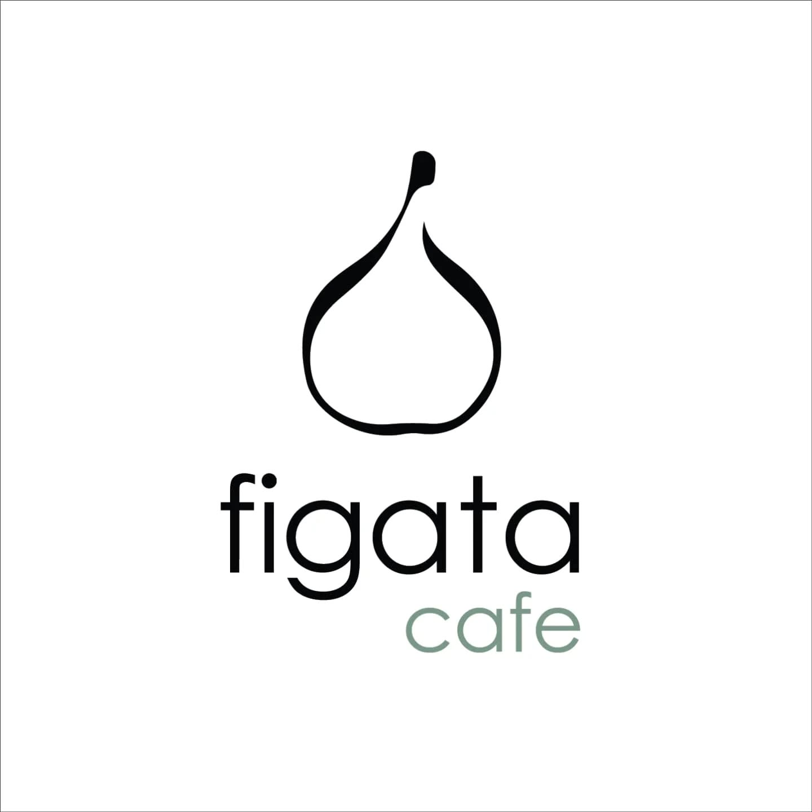

# Figata Café Website

A modern, responsive website for Figata Café - a local café showcasing its atmosphere, products, and unique charm.

## ✨ Features

- **Responsive Design** - Optimized for all devices from mobile to desktop
- **Image Gallery** - Dynamic image carousel with lightbox functionality
- **Multi-language Support** - Seamless translation between languages
- **Interactive UI** - Smooth animations and transitions for engaging user experience
- **Product Showcase** - Highlighting the café's offerings with beautiful imagery
- **Contact Information** - Easy access to location and contact details

## 🛠️ Tech Stack

- **Frontend Framework**: [Next.js 14](https://nextjs.org/) with App Router
- **Language**: [TypeScript](https://www.typescriptlang.org/)
- **Styling**: [Tailwind CSS](https://tailwindcss.com/)
- **Internationalization**: [next-intl](https://next-intl-docs.vercel.app/)
- **Image Management**: [Cloudinary](https://cloudinary.com/)
- **UI Components**:
  - [React Icons](https://react-icons.github.io/react-icons/)
  - Custom image lightbox and carousel components
- **Deployment**: [Vercel](https://vercel.com/)
- **Version Control**: Git

## 🌐 Deployment

The site is configured for easy deployment on Vercel.

## 📝 Project Structure

- **`/src/app`** - Next.js application routes
- **`/src/components`** - Reusable React components
- **`/src/actions`** - Server actions for data fetching
- **`/public`** - Static assets
- **`/i18n`** - Internationalization configuration and translations

## 🔍 Key Components

- **ImageLightbox** - Custom component for image viewing with zoom capability
- **ImageCarousel** - Interactive carousel for the gallery section
- **Responsive Navigation** - Adaptive navbar for all device sizes

## 📷 Cloudinary Integration

The gallery section uses Cloudinary to manage and deliver optimized images. Images are fetched from the designated "figata-cafe" folder using server-side actions.

## 🛡️ License

This project is licensed under the MIT License.

---

Built with ☕ and 💜 for Figata Café
